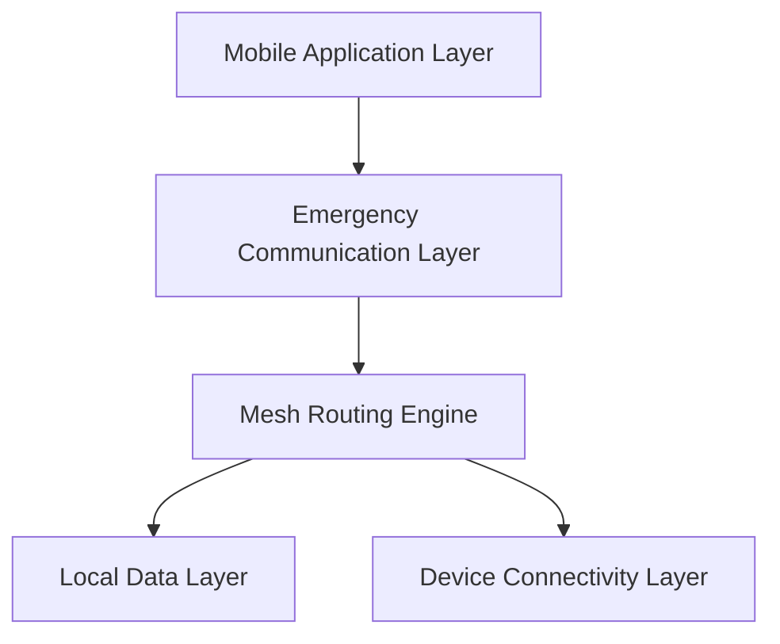

# Infrastructure-Free Emergency Communication Network
## เอกสารสถาปัตยกรรมระบบ (Architecture Specification) v1.0

---

# 1. บทนำ (Overview)

Infrastructure-Free Emergency Communication Network คือสถาปัตยกรรมเครือข่ายสื่อสารแบบกระจายศูนย์ (Decentralized Network)
ที่ออกแบบมาเพื่อใช้งานในสถานการณ์ฉุกเฉินหรือภัยพิบัติ

ระบบนี้สามารถทำงานได้โดยไม่ต้องพึ่งพา:
- เสาสัญญาณโทรศัพท์
- อินเทอร์เน็ต
- ศูนย์กลางควบคุม

เครือข่ายทำงานในรูปแบบ Mesh Network
โดยอุปกรณ์แต่ละเครื่องทำหน้าที่เป็นทั้งผู้ส่งและผู้ส่งต่อข้อมูล (Relay Node)

---

# 2. วิสัยทัศน์ (Vision)

ระบบมีเป้าหมายเพื่อ:

- รองรับการสื่อสารฉุกเฉินในพื้นที่ที่โครงสร้างพื้นฐานล่ม
- ช่วยเพิ่มโอกาสรอดชีวิตในสถานการณ์ภัยพิบัติ
- สร้างเครือข่ายที่สามารถ Self-Healing ได้
- รองรับการส่งข้อความแบบ Multi-hop
- เพิ่มความปลอดภัยและความเป็นส่วนตัวของข้อมูลผู้ประสบภัย

---

# 3. สถาปัตยกรรมภาพรวม (High-Level Architecture)

ระบบแบ่งออกเป็น 5 ชั้นหลัก:

---
# 4. องค์ประกอบหลักของระบบ (Core Components)
