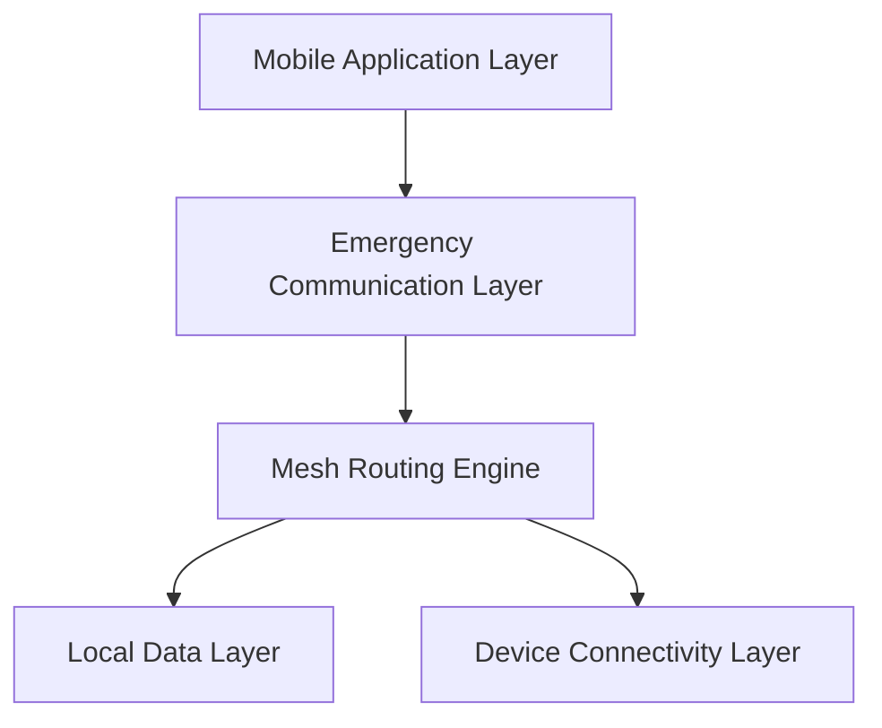

# Infrastructure-Free Emergency Communication Network
## เอกสารสถาปัตยกรรมระบบ (Architecture Specification) v1.0

---

# 1. บทนำ (Overview)

Infrastructure-Free Emergency Communication Network คือสถาปัตยกรรมเครือข่ายสื่อสารแบบกระจายศูนย์ (Decentralized Network)
ที่ออกแบบมาเพื่อใช้งานในสถานการณ์ฉุกเฉินหรือภัยพิบัติ

ระบบนี้สามารถทำงานได้โดยไม่ต้องพึ่งพา:
- เสาสัญญาณโทรศัพท์
- อินเทอร์เน็ต
- ศูนย์กลางควบคุม

เครือข่ายทำงานในรูปแบบ Mesh Network
โดยอุปกรณ์แต่ละเครื่องทำหน้าที่เป็นทั้งผู้ส่งและผู้ส่งต่อข้อมูล (Relay Node)

---

# 2. วิสัยทัศน์ (Vision)

ระบบมีเป้าหมายเพื่อ:

- รองรับการสื่อสารฉุกเฉินในพื้นที่ที่โครงสร้างพื้นฐานล่ม
- ช่วยเพิ่มโอกาสรอดชีวิตในสถานการณ์ภัยพิบัติ
- สร้างเครือข่ายที่สามารถ Self-Healing ได้
- รองรับการส่งข้อความแบบ Multi-hop
- เพิ่มความปลอดภัยและความเป็นส่วนตัวของข้อมูลผู้ประสบภัย

---

# 3. สถาปัตยกรรมภาพรวม (High-Level Architecture)

ระบบแบ่งออกเป็น 5 ชั้นหลัก:


---
# 4. องค์ประกอบหลักของระบบ (Core Components)
## 4.1 Device Connectivity Layer

- ค้นหาอุปกรณ์ใกล้เคียง (Peer Discovery)
- เชื่อมต่อผ่าน Bluetooth / Wi-Fi Direct
- จัดการการเชื่อมต่อแบบ Peer-to-Peer
- ตรวจจับการหลุดของโหนด

---
## 4.2 Mesh Routing Engine

เป็นหัวใจของระบบการส่งต่อข้อความ

ความสามารถ:

- ส่งต่อข้อความแบบ Multi-hop
- ตรวจจับและป้องกันข้อความซ้ำ (Duplicate Detection)
- จัดการ Unique Message ID
- รองรับ Acknowledgement

---
### Mesh Routing Algorithm (Pseudo-code)
```python
    def forward_message(message, peer_list):

    if message.id in local_cache:
        return

    store(message)

    for peer in peer_list:
        send(peer, message)
```
---
### 4.3 Emergency Communication Layer

จัดการข้อความฉุกเฉินและลำดับความสำคัญ

คุณสมบัติ:
- โหมด Emergency Broadcast
- กำหนดระดับความสำคัญ (Normal / High / Critical)
- แนบพิกัด GPS
- แสดงข้อความเร่งด่วนบนหน้าจอ

  ---
### EmergencyMessage Data Structure
```typescript
      interface EmergencyMessage {
    messageId: string
    senderId: string
    message: string
    location?: string
    priorityLevel: "normal" | "high" | "critical"
    timestamp: number
}
```
---
### 4.4 Local Data Layer

- จัดเก็บข้อความในฐานข้อมูลภายในเครื่อง
- เก็บประวัติการส่งและรับข้อความ
- แคชข้อความเพื่อป้องกันการส่งซ้ำ
- รองรับการทำงานแบบ Offline-First

---

### 4.5 Mobile Application Layer

ส่วนติดต่อผู้ใช้ (User Interface)

ฟังก์ชันหลัก:

- พิมพ์และส่งข้อความฉุกเฉิน
- เปิด/ปิด Emergency Mode
- แสดงสถานะการเชื่อมต่อโหนด
- แสดงตำแหน่งผู้ส่งบนแผนที่ (Prototype)

---
# 5. โปรโตคอลการสื่อสาร (Communication Protocol)

## Emergency Mesh Transfer Protocol (EMTP)

### ขั้นตอนการทำงาน

1. ผู้ใช้พิมพ์ข้อความฉุกเฉิน
2. ระบบสร้าง **Unique Message ID**
3. แนบ **Timestamp** และพิกัด (ถ้ามี)
4. Broadcast ไปยังโหนดใกล้เคียง
5. โหนดที่รับข้อความทำการตรวจสอบ Duplicate
6. หากไม่ซ้ำ → ส่งต่อไปยังโหนดอื่น
7. ดำเนินการต่อแบบ Mesh จนกว่าจะถึงปลายทาง

EMTP รองรับการสื่อสารแบบ **Delay-Tolerant**  
เหมาะสำหรับสถานการณ์ที่เครือข่ายไม่เสถียรหรือขาดช่วง

---

# 6. ข้อกำหนดที่ไม่ใช่เชิงหน้าที่ (Non-Functional Requirements)

| หมวดหมู่ | ข้อกำหนด |
|-----------|------------|
| Scalability | รองรับการเพิ่มจำนวนโหนดแบบไดนามิก |
| Reliability | ระบบสามารถทำงานได้แม้บางโหนดล้มเหลว |
| Security | รองรับการเข้ารหัสข้อความเบื้องต้น |
| Performance | เวลาส่งข้อความเฉลี่ยไม่เกิน 3 วินาที |
| Energy Efficiency | ใช้พลังงานต่ำ |

---

# 7. กรณีการใช้งาน (Use Cases)

1. การสื่อสารในพื้นที่ที่ไม่มีสัญญาณมือถือ
2. การประสานงานทีมกู้ภัย
3. การขอความช่วยเหลือในเหตุแผ่นดินไหว
4. การแจ้งเตือนภัยในพื้นที่ห่างไกล

---

# 8. ข้อจำกัดทางเทคโนโลยี (Technological Constraints)

- ระยะการเชื่อมต่อ Bluetooth จำกัด
- การใช้พลังงานของอุปกรณ์
- ความหนาแน่นของผู้ใช้งานในพื้นที่
- ความแม่นยำของ GPS ในบางสภาพแวดล้อม
- ความเข้ากันได้ของอุปกรณ์ต่างรุ่น

---

# 9. การขยายในอนาคต (Future Extensions)

- รองรับ iOS Version
- เพิ่ม End-to-End Encryption
- เพิ่มการส่งภาพ/เสียง
- เชื่อมต่อกับระบบกู้ภัยภายนอก
- รองรับ Satellite Relay (ในอนาคต)

---

# 10. สรุป (Conclusion)

**Infrastructure-Free Emergency Communication Network**  
เป็นสถาปัตยกรรมเครือข่ายสื่อสารฉุกเฉินแบบกระจายศูนย์  
ที่สามารถทำงานได้โดยไม่พึ่งโครงสร้างพื้นฐานดั้งเดิม

ระบบนี้ช่วยเพิ่มความยืดหยุ่น ความทนทาน และความสามารถในการสื่อสาร  
ในสถานการณ์ที่เครือข่ายหลักล่มหรือไม่สามารถใช้งานได้

เป็นแนวทางสำคัญสำหรับการพัฒนาเทคโนโลยีเพื่อความปลอดภัยของมนุษย์ในอนาคต
